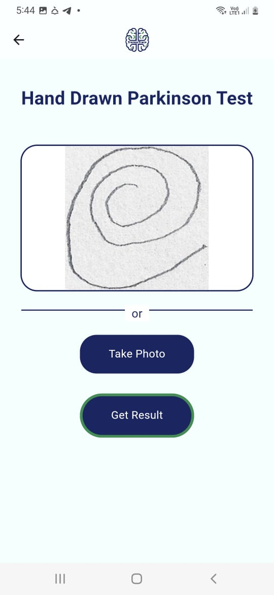
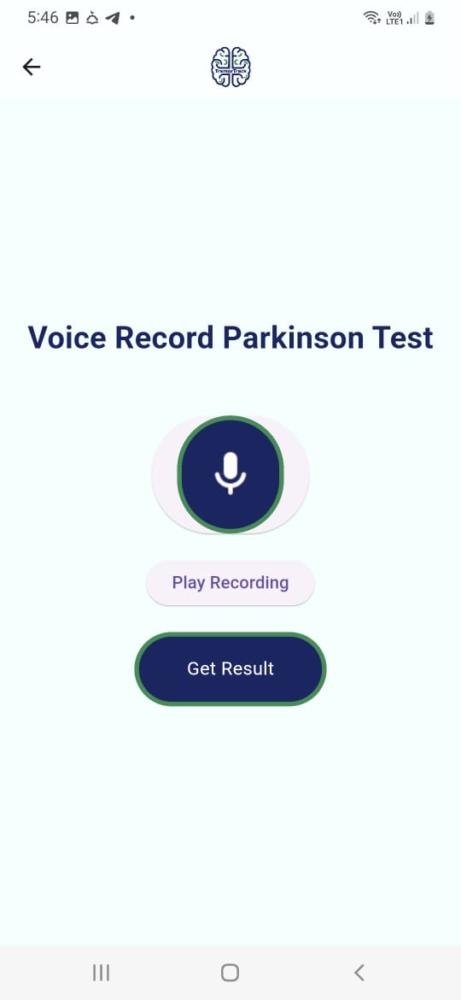
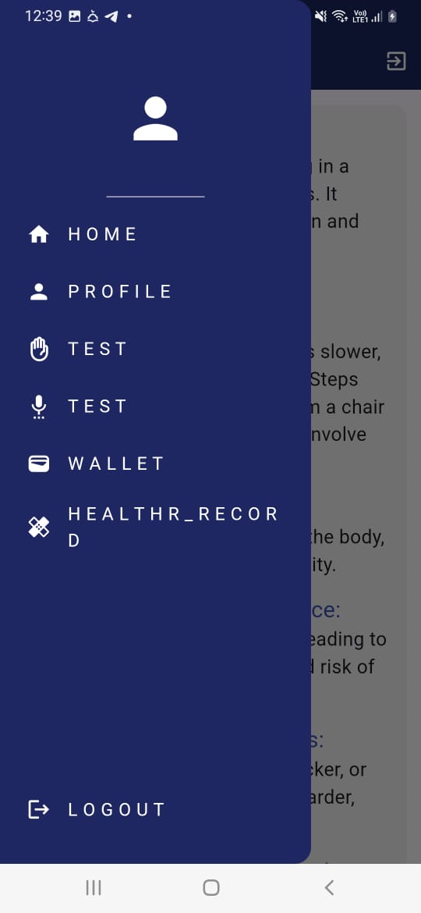

## Tremor Track

A mobile app designed to help detect Parkinson's disease through handwriting and voice analysis. It uses machine learning (TensorFlow Lite) to analyze user input and stores results and consultations in Firebase.

## 💡 Features

- Handwriting analysis using CNN model
- Voice frequency analysis (MDVP features)
- Firebase Authentication
- Firestore for storing test results and user roles
- Chat system for patient-doctor communication
- Wallet & point system to manage test access and payments

## 🛠 Technologies Used

- Flutter
- Firebase Auth & Firestore
- Firebase Storage
- audioplayers / flutter_sound
- Provider for state management

## 📷 Screenshots

